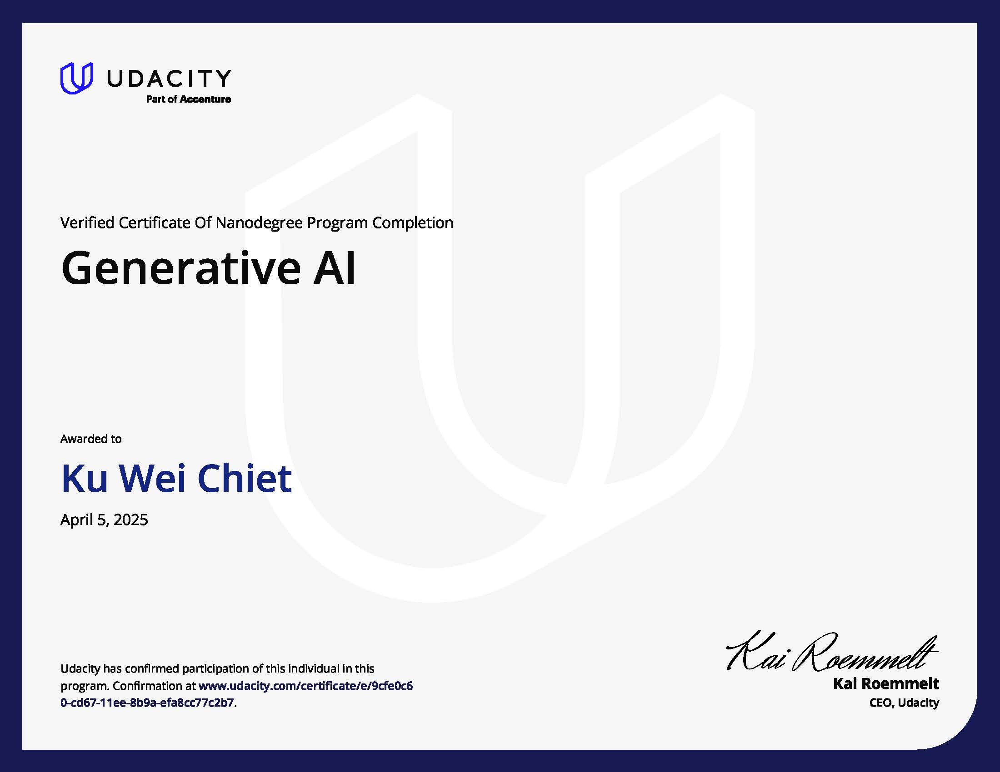

# Generative AI Nanodegree Program

## Program Overview

This repository contains projects and coursework from the **[Udacity Generative AI Nanodegree](https://www.udacity.com/course/generative-ai--nd608)**, focused on building practical applications with cutting-edge generative AI tools and models.

Core skills developed:
- Prompt engineering and foundation model adaptation  
- Custom chatbot development with large language models (LLMs)  
- Image inpainting using Stable Diffusion and SAM  
- Retrieval-Augmented Generation (RAG) and vector database integration  

🎓 [View Certificate](https://www.udacity.com/certificate/e/9cfe0c60-cd67-11ee-8b9a-efa8cc77c2b7)  

---

## Course Syllabus & Projects

### 1. GenAI Fundamentals

Learn the foundations of generative AI, including PEFT (Parameter-Efficient Fine-Tuning), and work with tools like Hugging Face and PyTorch to fine-tune large models efficiently.

**🛠️ [Project 1: Apply Lightweight Fine-Tuning](./project_1)**  
- Load a foundation model  
- Use a custom dataset  
- Fine-tune using parameter-efficient techniques  

---

### 2. LLMs & Text Generation

Explore how LLMs understand and generate language. Build a retrieval-augmented chatbot powered by custom data and semantic search.

**🛠️ [Project 2: Build a Custom Chatbot](./project_2)**  
- Gather custom datasets (via APIs, scraping, etc.)  
- Build a semantic vector search pipeline  
- Generate RAG-based responses using a foundation model  

---

### 3. Computer Vision & Generative AI

Use SAM and Stable Diffusion to create image-editing applications with AI-generated content based on user prompts.

**🛠️ [Project 3: AI Photo Editing](./project_3)**  
- Segment image regions with SAM  
- Replace image parts using text prompts and inpainting  
- Create a web interface for user interaction  

---

### 4. Building Generative AI Solutions

Develop production-ready AI systems using LangChain, semantic search, and vector databases for real-world tasks like personalized recommendations.

**🛠️ [Project 4: Personalized Real Estate Agent](./project_4)**  
- Generate synthetic listing data  
- Store and query with vector embeddings  
- Deliver personalized property suggestions using RAG  
