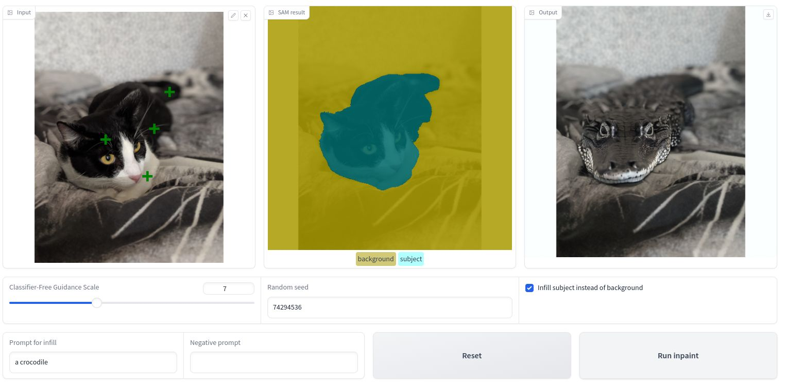

# 🎨 AI Photo Editing App

## 📌 Project Overview

In this project, you'll build an interactive **AI-powered photo editing app** that allows users to intelligently modify their images using modern computer vision and generative AI tools.

The app enables users to:
- ✂️ Select and isolate subjects or backgrounds
- 🖼️ Replace backgrounds using descriptive text prompts
- 👥 Swap out the subject while keeping the original background
- 🧼 Remove or mask objects in a photo

This project combines **image segmentation** with **text-to-image generation**, providing a hands-on experience with state-of-the-art models like **Segment Anything Model (SAM)** and **diffusion models** for generative editing.

    
    With our app we will be able to swap out the background of an image and substitute it with a computer-generated one described through text

    
We can also substitute the subject instead of the background

---

## 🧠 Core Features

### 🔍 Subject Selection
- Upload an image
- Click to select the primary object
- Use **SAM** to generate multiple segmentation masks
- Select or refine the best mask using additional points

### 🎨 Background or Subject Replacement
- Provide a **text prompt** to describe the desired background or new subject
- Optionally include a **negative prompt** to improve result accuracy
- Use a **text-to-image diffusion model** to generate the new scene
- Apply the generation only to the masked region

### 🔁 Optional Inversion
- Swap the background or **invert the mask** to replace the subject instead

---

## ⚙️ What You’ll Implement

As the developer, your tasks include:

- 🔧 Integrating and calling the **Segment Anything Model**
- 🧠 Processing user interactions to refine the segmentation mask
- 🖼️ Connecting the **text-to-image diffusion model** to the UI
- 📷 Creating final composited images based on mask + generation

This combination of segmentation and generative AI allows users to seamlessly edit photos with natural language—no Photoshop skills needed!

---

## 🚀 Use Cases

- 📸 Creative photo editing
- 👗 Virtual try-ons and style swapping
- 🗺️ Travel photo backgrounds
- 📱 Social media content creation
- 🔍 Object removal or background cleanup

---

## 📂 Deliverables

Project outputs are stored in the [`/deliverables`](./deliverables) folder, including:

- 💻 Source code for the SAM integration and generation pipeline  
- 🖼️ Sample input and edited images  

