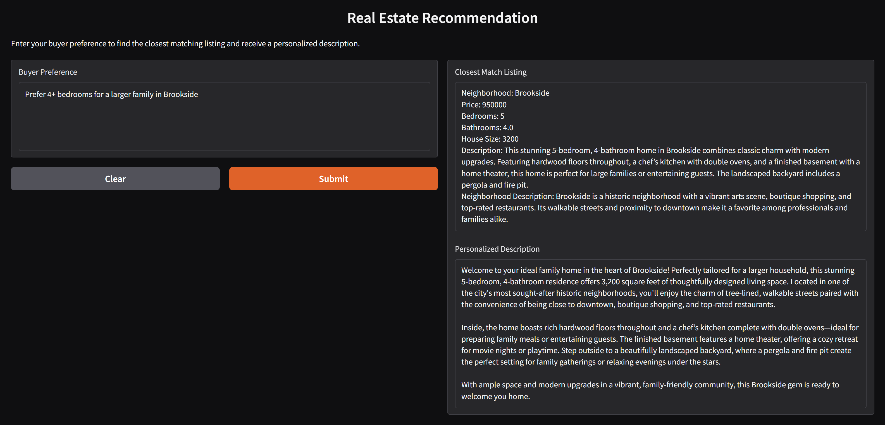

# 🏡 Personalized Real Estate Agent – *HomeMatch*

## 📌 Project Overview

As a developer at *Future Homes Realty*, you're tasked with building an innovative AI-powered application—**HomeMatch**—to transform the way clients discover real estate. This project harnesses **large language models (LLMs)** and **vector databases** to create a personalized property browsing experience, tailored to each buyer’s unique lifestyle and preferences.

---

## 🎯 Project Objective

The goal of HomeMatch is to:
- 🔍 Understand nuanced buyer preferences expressed in natural language  
- 🗂️ Match preferences to property listings using semantic similarity  
- ✍️ Generate personalized property descriptions that resonate with buyers

This application brings the power of **semantic search**, **LLMs**, and **custom prompting** together to elevate the home-buying experience.

---

## 🧠 Key Features

### 1️⃣ Buyer Preference Collection
- Collect detailed, free-text preferences about location, amenities, lifestyle, and more.
- Parse preferences using an LLM to extract meaning beyond basic filters.

### 2️⃣ Listing Matching via Vector Database
- Store real estate listings in a **vector database** like ChromaDB.
- Generate embeddings for listings and preferences to enable **semantic search**.
- Return the most relevant listing(s) based on vector similarity.

### 3️⃣ Personalized Description Generation
- Use an LLM to rewrite the listing description, highlighting features aligned with the buyer’s preferences.
- Ensure factual accuracy while enhancing emotional and lifestyle appeal.

### 4️⃣ Gradio App for Real-Time Interaction
- Accept user input via a clean interface
- Instantly return matched listings with personalized descriptions

---

## ⚙️ Technical Stack

- 🧠 OpenAI API (LLM for generation and preference interpretation)  
- 🧲 ChromaDB (or other vector database)  
- 📊 pandas (for data manipulation)  
- 🧪 Gradio (for the user interface)  
- 📁 CSV-based datasets

---

## 📂 Deliverables

All key files and outputs for the **HomeMatch** application are organized as follows under the `deliverables` folder:

### 🗂️ Project Structure

- `data/` — Contains saved real estate listings and buyer preferences in CSV format  
- `HomeMatch_development.ipynb` — Jupyter notebook containing development code and sample outputs  
- `HomeMatch.py` — A standalone Gradio app for user interaction

### 🚀 Usage

An **OpenAI API key** is required for both the notebook and Python script.

To launch the Gradio app:

```bash
python HomeMatch.py
```

The interface will accept buyer preferences and return:
- 🏠 The closest matched listing
- ✍️ A custom, personalized description based on buyer intent



---

## 📈 Example Scenario

**Buyer Preferences (Sample Input):**
- “Looking for a cozy three-bedroom with a garden and eco-friendly features in a quiet neighborhood with schools nearby.”

**Matched Listing Output:**
- "This peaceful Green Oaks home offers a lush backyard garden, solar panels, and a family-friendly community close to top-rated schools..."

---

## ✅ Project Highlights

- Seamless blend of **LLM-based NLP** and **vector similarity search**
- Realistic simulation of AI-powered real estate matching
- Customizable and extensible framework for future applications

---